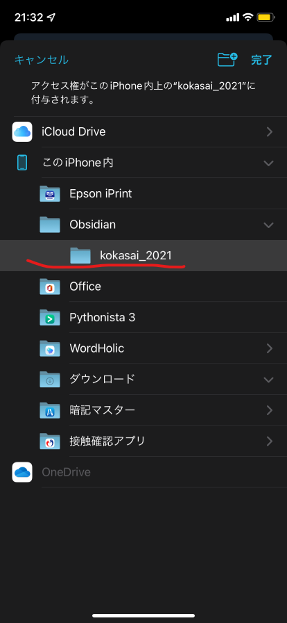

# はじめに
多くの方は、マークダウンを書くときにはパソコンを使うかと思います。しかし、実はパソコンがなくてもマークダウンはかけるのです！<br>
そこで今回はスマホでマークダウンを書く方法についてご紹介します。
このガイドは、rsteeleさんの[[Mobile] Setting up iOS git-based syncing with mobile app (using Working Copy)](https://forum.obsidian.md/t/mobile-setting-up-ios-git-based-syncing-with-mobile-app-using-working-copy/16499)を参考にして書きました。
## 前提条件
[working copy](https://apps.apple.com/jp/app/working-copy-git-client/id896694807)を自由に使うためには、Proアカウントが必要です。(無課金でも使える機能はあります)。もし、あなたが学生ならば、working copy様が、学生向けにプランを出してくださっています。
なお、この記事はios向けです。
## アプリをインストール
さて、さっそくアプリをインストールしましょう。
必要になるのは、
- [working copy](https://apps.apple.com/jp/app/working-copy-git-client/id896694807)
- [obsidian](https://apps.apple.com/jp/app/obsidian-connected-notes/id1557175442)

の2つのアプリが必要です。
## Working Copyのセットアップ
1. [Working Copy for students](https://workingcopy.app/education/)にアクセスして、tap hereのリンクを押します。<br>

2. アプリが自動で開かれるので、Githubのアカウントでサインインしてください。<br>

3. サインインしたら、クローンします。右上の**+**ボタンをタップして、**Clone repository**をタップします。<br>

4. すると、クローンするリポジトリが表示されるので以下のURLを入力して、
```URL
https://github.com/nitgc-densan-club/2021-club-journal.github.io.git
```
**Clone**してください。
5. クローンしてきたら、ブランチを切ります。
**2021-club-journal.github.io**->**Repository**->**Branch**でブランチの名前を変更してください。なお変更しないと、デフォルトではmainブランチで作業することになり、pushが拒否されるかと思います。


## OBSIDIANのセットアップ
1. Obsidianを開き、**Create new vault**をタップしてください。<br>

2. すると、名前を聞かれるので、お好きな名前を付けてみてください。ここでは**kokasai_2021**にしました。<br>

3. すると、作業環境が開かれるので、右上のハンバーガーボタン->設定アイコン->Aboutの順にタップして、Languageに日本語を設定して、Relaunchを、Override config folderには
```
.obsidian.mobile
```
と入力して、Relaunchしてください。<br>


## Working CopyとObsidianの共有
ここでは、Working CopyとObsidianの共有方法について説明します。
1. Working Copyのセットアップの5節まで進めたら、右上の共有ボタンをタップしてください。<br>

2. 共有画面が出たら、**Setup Folder Sync**をタップしてください。<br>

3. Obsidianに先ほど用意したディレクトリを選択してください。<br>

4. Obsidianを開くとフォルダが開きました!<br>
<br>
# おわりに
以上で編集できるようになりました。
Obsidianは非常に便利な編集アプリですので是非使ってみてください。