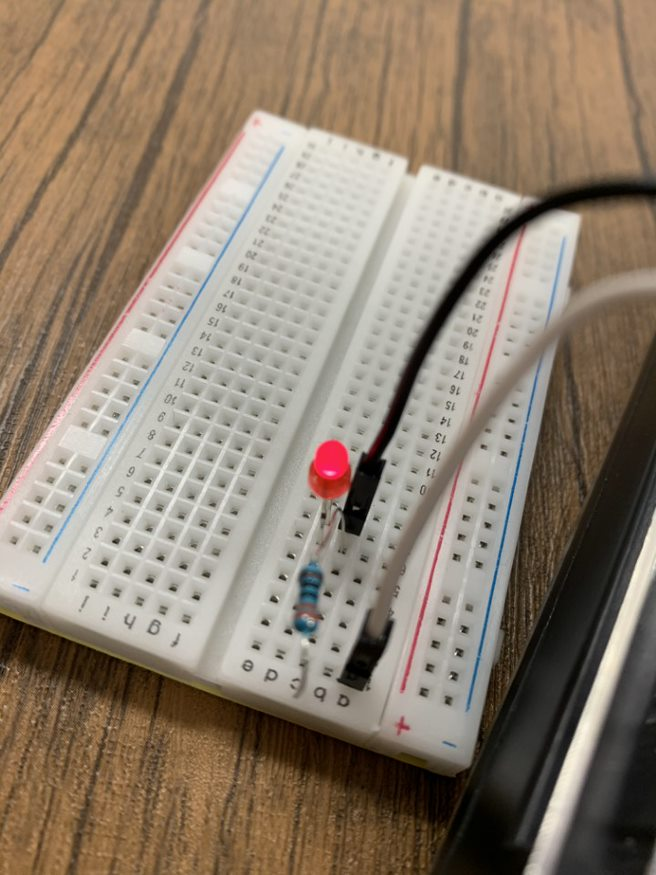
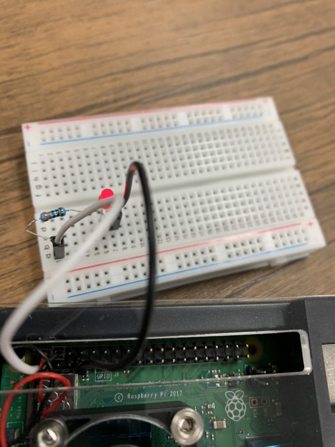
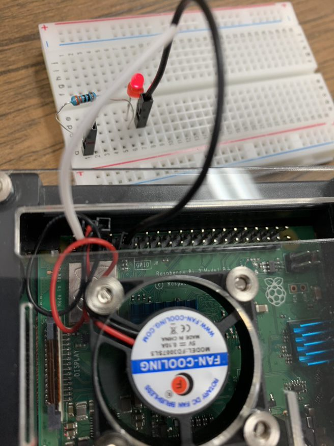

# はじめに
今回のLチカ体験の方法について説明します。
## 必要なもの
- [Raspberry pi](https://www.raspberrypi.org/)
- [Raspbian](https://www.raspbian.org)
- ブレッドボード
- LED
- 330Ωの抵抗
### ソフトウェアのインストール
今回のLチカ体験で、使用するソフトのインストール方法です。
ターミナルを開き下記コマンドで、ソフトをインストールしてください。
```shell
sudo apt install vim gcc python3
wget https://project-downloads.drogon.net/wiringpi-latest.deb
sudo dpkg -i wiringpi-latest.deb
```
さて、上記コマンドでインストールされるソフトについて紹介します。<br>
[vim](https://github.com/vim/vim)はターミナル上で動くテキストエディタです。独特な操作体系を持ちますが、なれると非常に快適です。<br>
[gcc](https://gcc.gnu.org/)はC言語のコンパイラです。<br>
[python3](https://www.python.org/)はpythonです。<br>
### 配線方法
写真のように配線してください。


LEDには極性があります!
正しく配線されると、ラズパイの電源を入れた時から、下の写真のように、LEDが点灯します。

### 実行方法
今回のガイドでは、C言語とPythonを用いた、実行方法をご紹介します。
#### Pythonを使う方法
ターミナル上で、
```shell
vim main.py
```
と入力すると、Vimが立ち上がります。
そして、下記に示したソースコードを入力してください。

```python
# GPIOを扱うため
import RPi.GPIO as GPIO

# 時間を扱うため
import time

# GPIOに対応するポート番号
PNO = 3
# ピン番号の指定
GPIO.setmode(GPIO.BOARD)
GPIO.setup(PNO, GPIO.OUT)
# print⽂で画⾯に表⽰する
print("How many times?")
# 変数に⼊⼒内容を代⼊
loopn = input()
print("How long sleep?")
stop = input()
# 0~⼊⼒された数未満まで繰り返す
for i in range(loopn):
    # HighでLEDを光らせる
    GPIO.output(PNO, GPIO.HIGH)
    time.sleep(stop)
    # LowでLEDを消す
    GPIO.output(PNO, GPIO.LOW)
    time.sleep(stop)
GPIO.cleanup()
```
上記のソースを実行するにはターミナル上で、
```shell
python main.py
```
と入力すると、指定した回数、間隔で動作します!
#### C言語を使う方法
ターミナル上で、
```shell
vim main.c
```
と入力すると、vimが立ち上がるので、下記に示したソースコードを入力してください。
```c
#include <wiringPi.h> //GPIOを扱うため

#include <stdio.h> //printf関数を使うため

#define LED_PORT 8 //GPIOに対応するポート番号
int main() {
  int loopn, stop;
  wiringPiSetup();
  // ピン番号の指定
  pinMode(LED_PORT, OUTPUT);
  printf("How many times?");
  scanf("%d", & loopn);
  printf("How long sleep?");
  scanf("%d", & stop);
  for (int i = 0; i < loopn; i++) {
    //1でLEDを光らせる
    digitalWrite(LED_PORT, 1);
    //delay関数で間隔を指定する
    delay(stop);
    //0でLEDを消す
    digitalWrite(LED_PORT, 0);
    delay(stop);
  }
  return 0;
}
```
そして、入力して実行する際にはターミナル上で、以下のコマンドを入力してください。
```shell
gcc main.c -lwiringPi
./a.out
```
 -lwiringPiがないとコンパイル時にエラーが出るので忘れないようにしてください。  
# おわりに
ラズパイは、電子工作が簡単にできていいですね!
# 参考文献
- [C言語でRaspberry Piを操作しよう](https://qiita.com/Brutus/items/54605b634c96b0b1e5cf)<br>
C言語でのLチカをするときの書き方について、参考にしました。