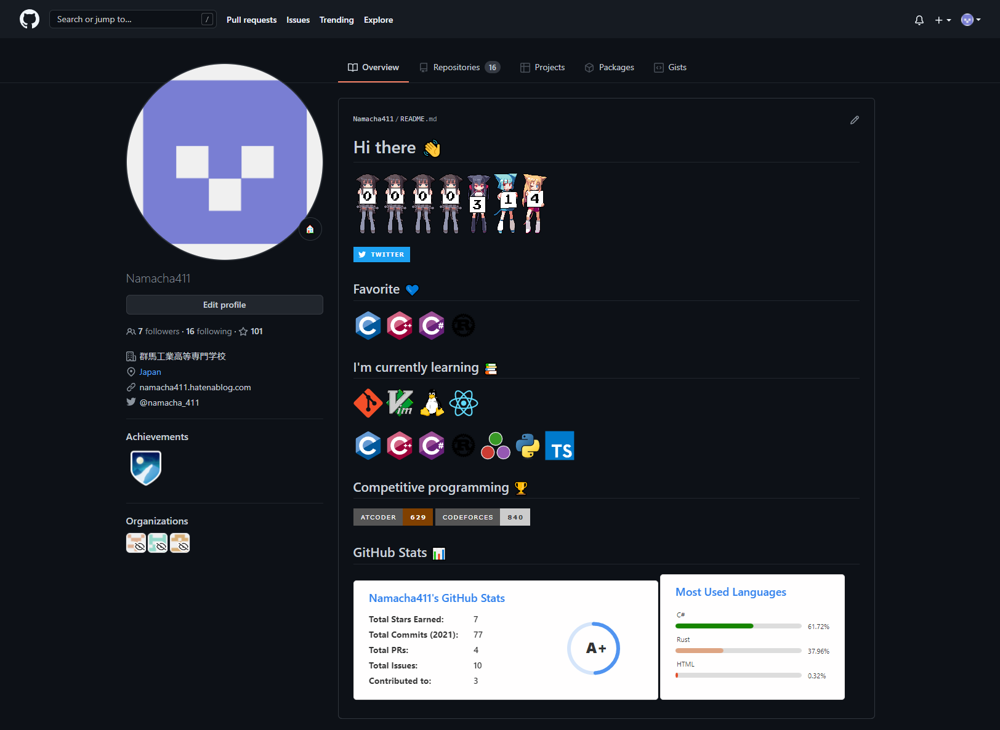

# GitHub Profile の勧め

## 目次

- 自己紹介
- はじめに
- 完成イメージ
- 使用したサービス・技術
  - 訪問者カウンター
  - Twitterバッチ
  - プログラミング言語１
  - プログラミング言語２
  - 競技プログラミングのレート
  - 統計情報１
  - 統計情報２
- その他参考にしたもの
- 感想

## 自己紹介

競技プログラミングが好きでやってます。
最近はだらだら気の向くままに開発してることがおおいです。

Twitter: <https://twitter.com/namacha_411>

GitHub: <https://github.com/Namacha411>

## はじめに

ほかのGitHubユーザのキラキラしたプロフィールを見て、
自分でもやってみたのでその時に調べたものをまとめます。
作ってみて楽しかったので皆さんも自分好みのプロフィールを作ってみてはどうでしょうか。

## 完成イメージ

自分はこんな感じのプロフィールを作ってみました。
(偶然スクショのタイミングでカウンターが314になって嬉しいです)

## 使用したサービス・技術

完成イメージにあるものを上から順番に紹介していきます。
また、使おうかどうか迷ったものもまとめて書いていくのでぜひ自分で作る際に参考にしてみてください。

以下、画像は少なめにする予定です。
タイトル欄にリポジトリへのリンクを埋め込んでおいたので興味があるものは直接見てみてください。

また、markdownの書き方、git、GitHubの使い方などは省略させていただきます。

### [訪問者カウンター](https://github.com/journey-ad/Moe-counter)

画像、名前の通り萌えカウンター(Moe-counter)というものを使いました。
訪問者数をカウントしてくれます。

かわいいのでお気に入りです。
設定次第でアニメーションを動かすことができます。

罠なのですが、vscodeでマークダウンを自動保存、自動レンダリングをオンにしながら編集すると、
カウントが一瞬で爆増するので注意してください。

### [Twitterバッチ](https://github.com/badges/shields)

Shieldsというバッチを簡単に作れるサービスがあるので、これを使いました。

細かく設定ができるので、応用が利き様々なバッチが作れます。
これを使ってより簡単にバッチが作れるサービスを作ってくれている方もがいるので、
自分で一から作るのが面倒な場合は、さがしてみるとより簡単にバッチが作れるかもしれません。

### [プログラミング言語1](https://github.com/devicons/devicon/)

deviconは[MITライセンス](https://github.com/devicons/devicon/blob/master/LICENSE)で公開されており、
プログラミング言語など様々なロゴを使用することができます。

豊富なロゴが高画質であるのでかなり使いやすいと思います。

### [プログラミング言語2](https://github.com/alexandresanlim/Badges4-README.md-Profile)

ロゴの部分はバッチにしようか迷いました。
プログラミング言語だけでなく、SNSやOSなど様々なバッチがまとめてあります。

### [競技プログラミングのレート](https://github.com/makutamoto/atcoder-badges)

atcoder-badgesを使いました。

ユーザーネームを入力するだけでバッチを作ってくれます。
ユーザーのレートに応じた色も付けてくれていい感じのバッチができます。

atcoderだけでなく、codefocesにも対応しているので、
両方で競技プログラミングをしている方には特におすすめです。

### [統計情報1](https://github.com/anuraghazra/github-readme-stats)

GitHub Readme Statsを使いました。

このリポジトリでは、日本語のドキュメントがあり、
具体的な使用例が豊富に書いてあったためとても設定しやすかったです。

シンプルでわかりやすいデザインであるところや、
表示時にちょっとしたアニメーションがあるところが気に入っています。

### [統計情報2](https://github.com/lowlighter/metrics)

統計情報はこっちを使用するか迷いました。

どちらかというとかっこいい感じで統計情報を表示してくれるものが多そうです。
36種類ものプラグイン、テンプレートがり、オプションは数百もあるらしいです。

これを使うとより凝ったものが作れそうな感じはあります。

## その他参考にしたもの

### [awsome-github-profile](https://github.com/zzetao/awesome-github-profile)

これめちゃくちゃ使いました。
いろんな人のプロフィールが載ってます。
GIFで掲載されていてアニメーションが動くので見やすく、
簡単に好みのプロフィールを探すことができます。

## 感想

あまりセンスのよくない自分ですが、個人的になかなかいいものができたのではないかと思っています。
ここに紹介されていないものでおすすめのプロフィールの書き方等あったらぜひ教えてほしいです。

Twitter、GitHubやってるのでフォローなどしてくれると嬉しいです。
良ければ絡んで下さい。

その他、ご意見・ご指摘・誤字脱字などもTwitterまたはGitHubまでお願いします。
