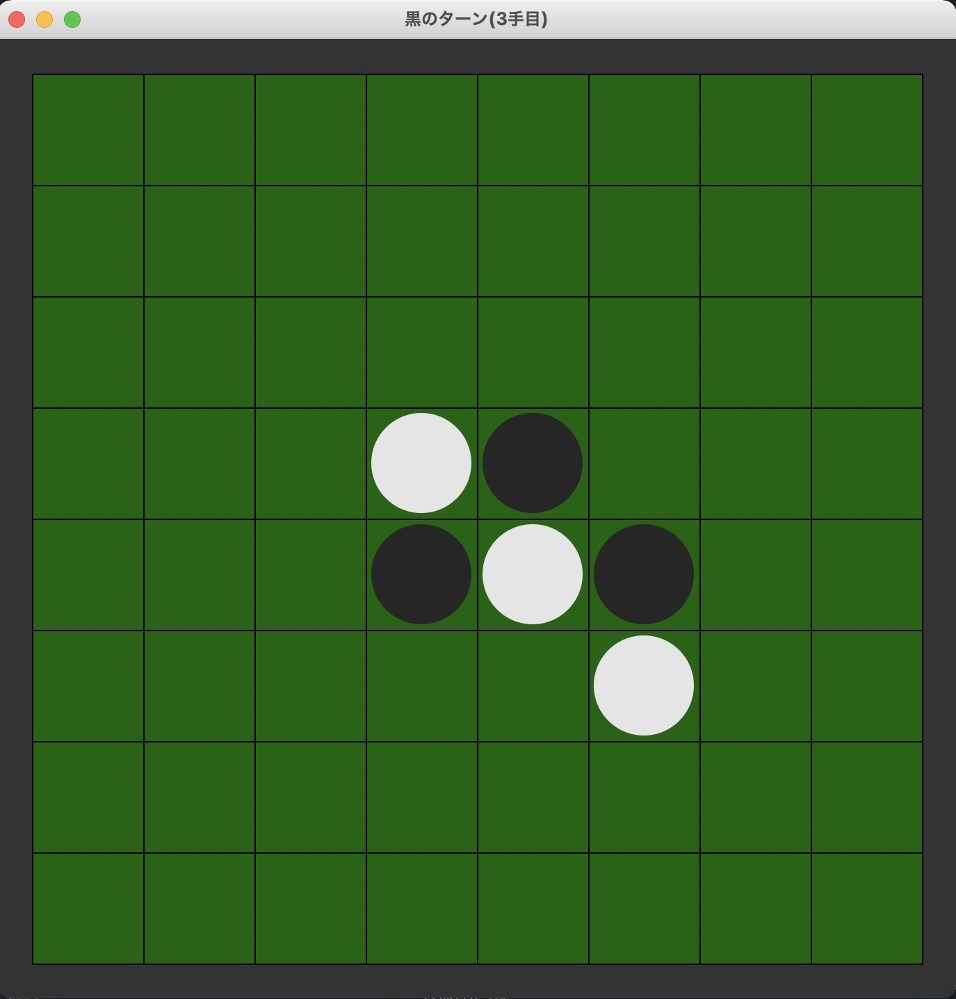
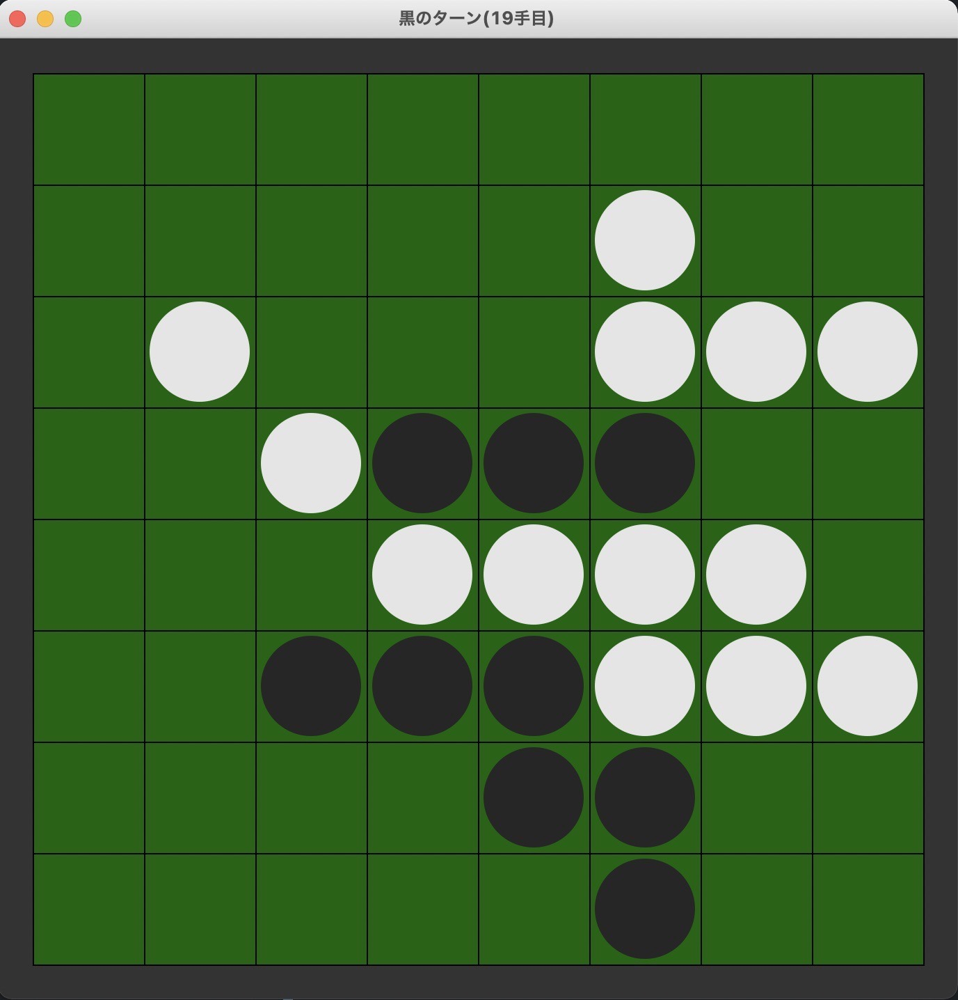
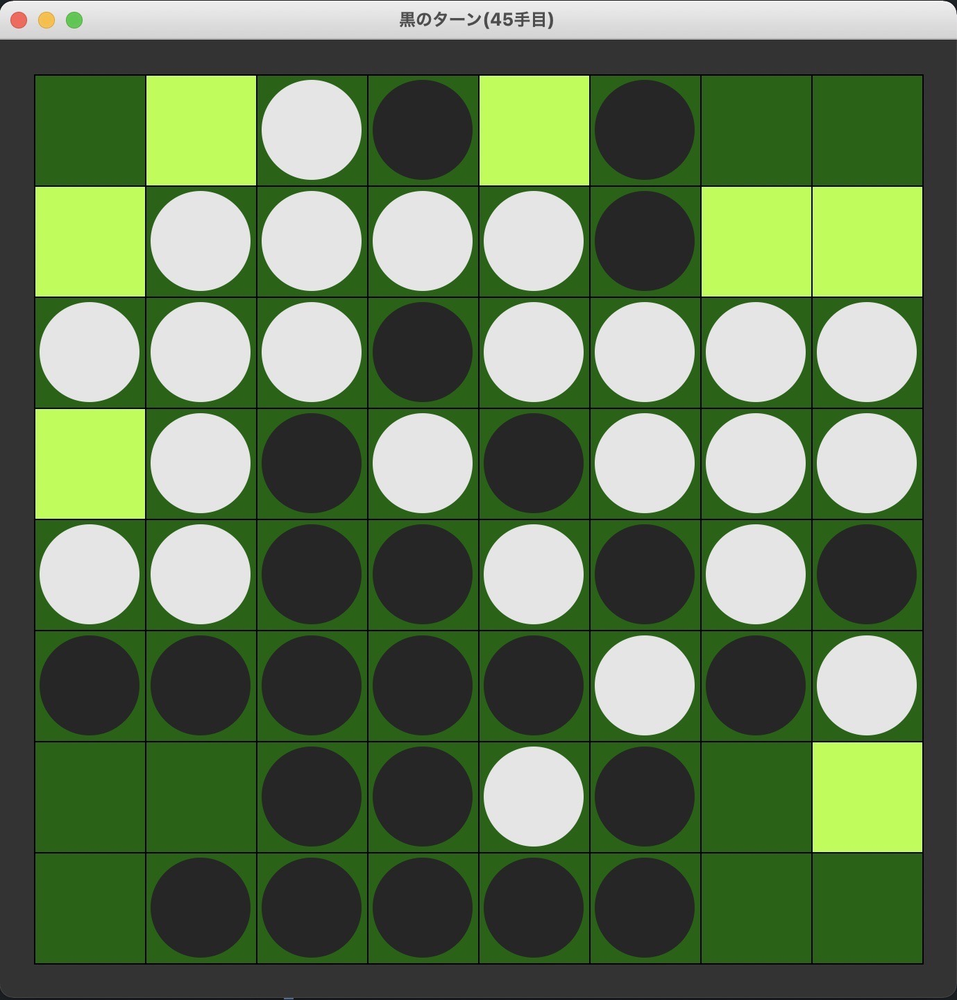
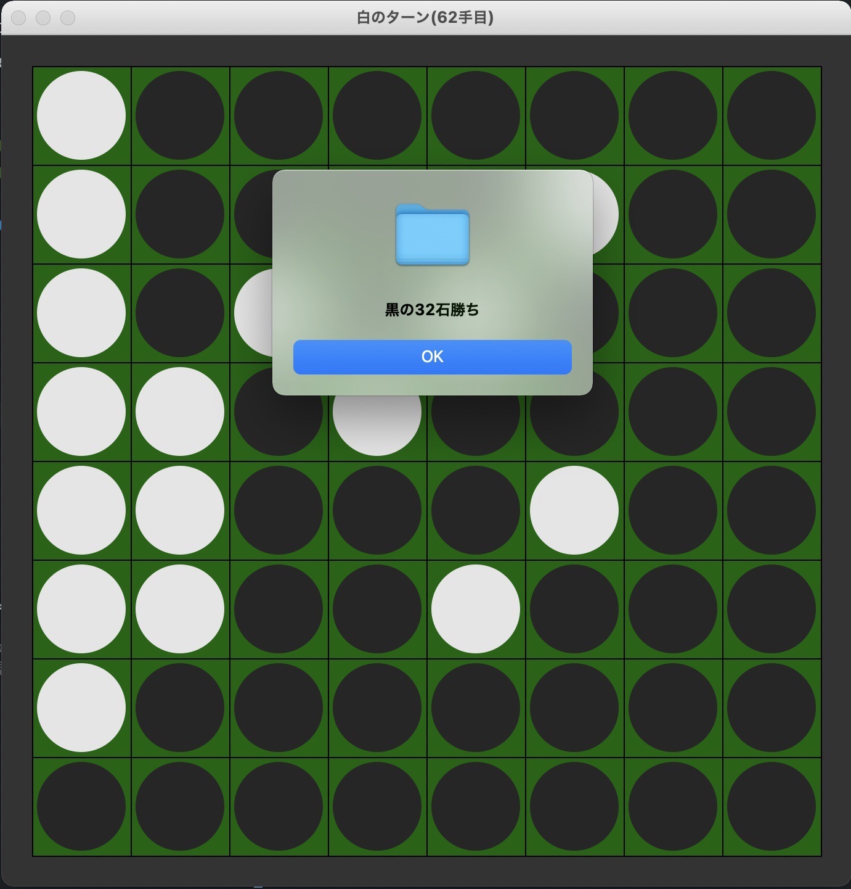
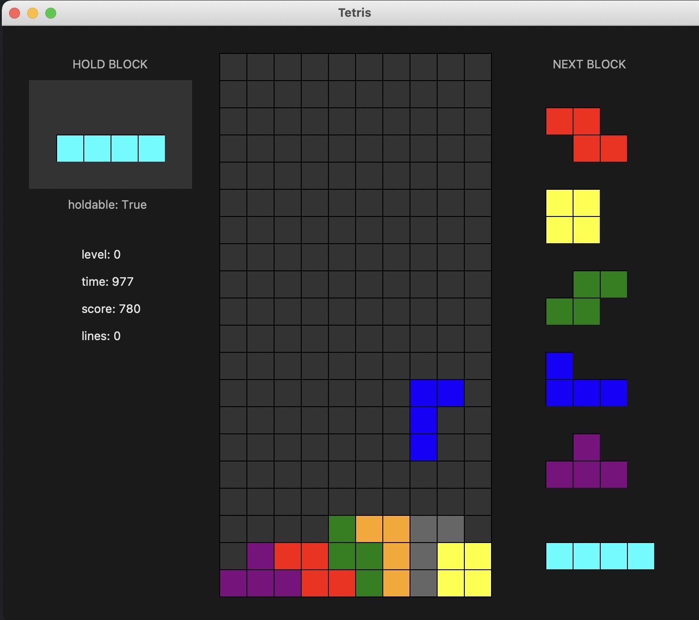
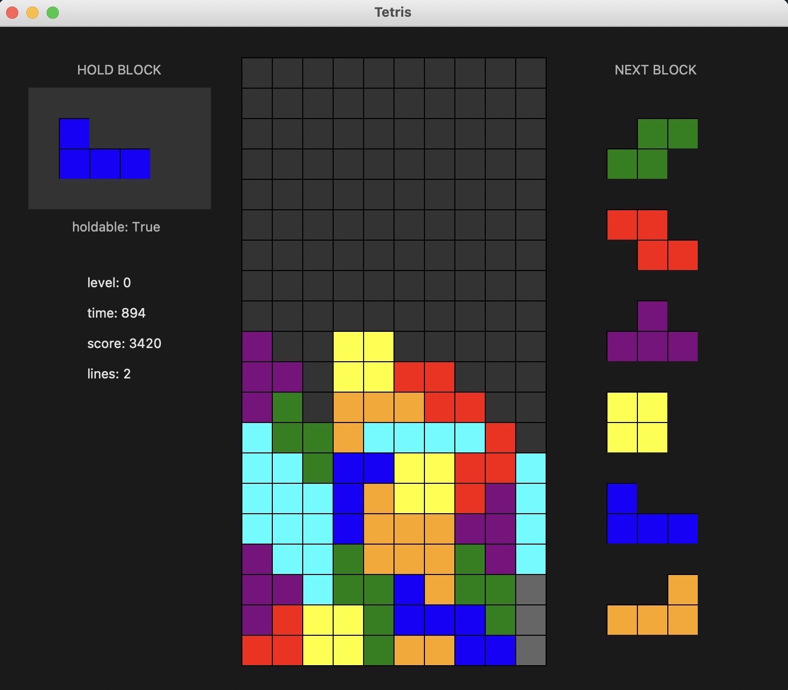
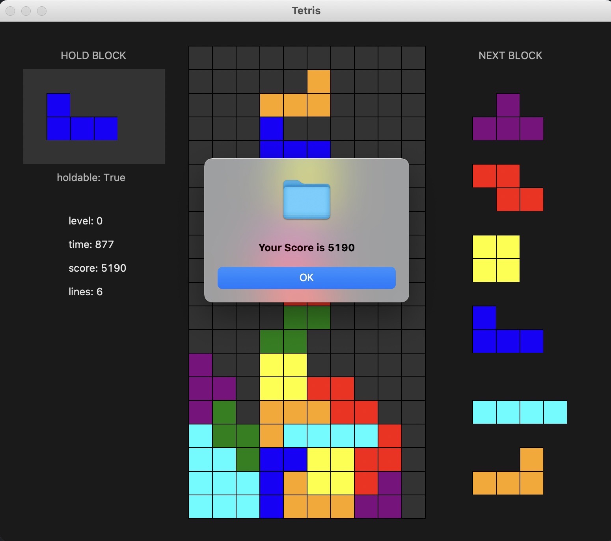

# まえがき
3Jのともはです。
みなさんは、プログラミングに興味ありますか？プログラミングは、あなたの発想次第でどんなものでも作ることが出来る、無限大の可能性を秘めています。何か作ってみたい！とは言っても、色々な言語があって分からないですよね。そこで今回、pythonという言語で作ったゲームをいくつか紹介したいと思います。

# pythonってどんな言語？
みなさんは、C言語に触れたことがありますか？C言語って、pythonを含むさまざまな言語の生みの親みたいな言語なんです。触れると分かるんですが、めっちゃ難しいんです。3Jの授業中にエラーをたくさん吐かれたときは泣きたくなりました、、

それに比べてpythonは、簡単でとても書きやすく、現在最も人気のある言語の一つなので、環境構築の方法も調べればすぐに出て来ます。人工知能って聞いたことありますか？あれも実はpythonで書かれているんですよ！

# ゲーム紹介
さて、pythonで作った簡単なゲームを二つほど紹介します。
## オセロ

こちらをご覧ください。デザインが本格的ですよね。なんとpythonでオセロが作れちゃうんです！作ったコンピュータと対戦してみます。黒い方が私です。

白が頭のいい置き方をしていますね。右の間に黒が置いた瞬間、完全に返されてしまいます。このコンピュータ、適当に置いている訳ではなく、実はちゃんと考えているんです。考えている、というと意志があるように思えますが、5手先の盤面までを「探索」する事で最適解を出しているだけなのです。「探索」は無数のアルゴリズムがあるので、興味のある方は是非、調べてみてください。

ちょっと不利になってきたので、置ける場所を可視化しました。こうして見ると、どこに置いても負けそうですよね。負けを確信したその時、、

なんと私が勝ってしまいました！角を３つも取らせてくれました。強さに影響するパラメータの調整に失敗したようです。今回は紹介できませんが、このコンピュータをディープラーニングと呼ばれる手法の人工知能で作れば、とても強いものになると思います。これは、強さの基準を人間が定めずとも、学習してどんどん強くなっていくので驚きです。興味のある方は是非、機械学習についての本を読んでみてください。

## テトリス

こちらもご覧ください。とってもカラフルですよね。なんとpythonでテトリスが作れちゃうんです！ここでは、簡単に紹介します。

長いミノが綺麗にハマりそうですね。これはとても気持ちが良いです。ラインを揃えると消え、スコアも加算されます。

やる気をなくしたようです。ゲームが終了してしまいました。スコアも表示されましたが、高いのかよく分かりません。テトリスはミノの回転処理がとても難しかったです。回転がうまくいき、綺麗にラインが消えたときはとても感動しました。簡単に遊べるゲームでも、作るのは非常に大変なのです。やる気のある方は是非、もっと難しいゲームを作ってみてはいかがでしょうか。

# さいごに
ここまで、pythonのゲームについて紹介しましたが、これらはtkinterと呼ばれるライブラリで作ったものです。pythonはゲーム制作に適した言語とは言えませんが、簡単にプログラミング言語を学ぶ上で、ゲームを作るのも面白いかもしれません。プログラミングでは、初めからクオリティの高いものを作ることは非常に困難です。ですが、基礎的な知識をコツコツと積み重ねていけば、いつの間にか素晴らしいアプリを開発するほどに成長します。プログラミングは可能性が無限大です。あなたのアイデアが、世界を変えるかもしれません！ここまで読んで頂き、ありがとうございました。