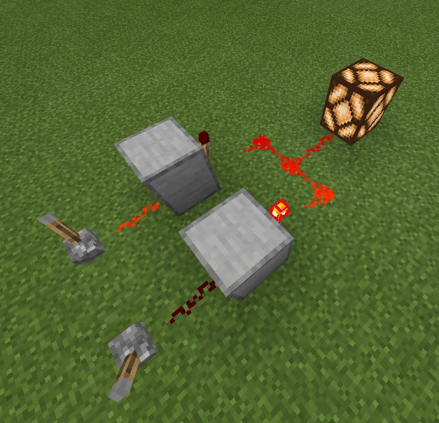
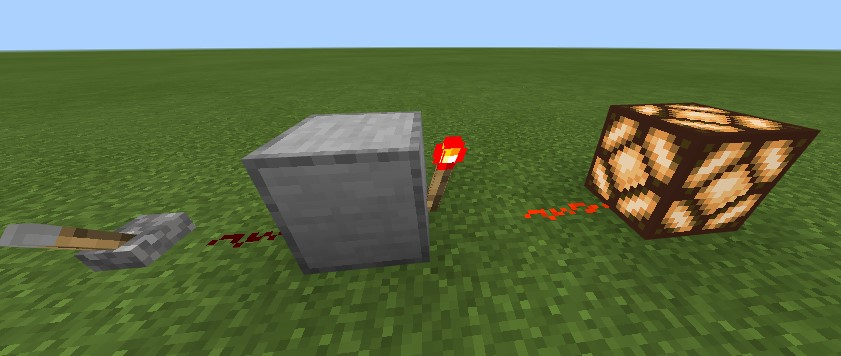
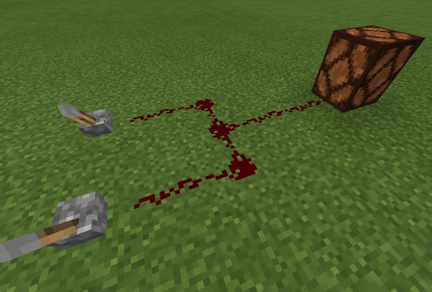
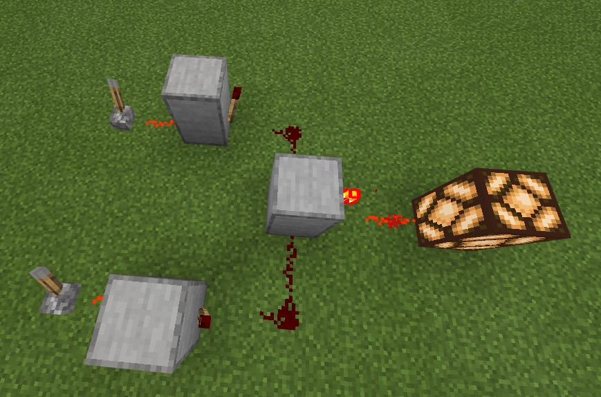

# はじめに
　[Minecraft](https://www.minecraft.net/ja-jp)というゲームを御存じですか？
説明する必要がないまでに有名なゲームです。
冒険したり、建築したり、PvPしたりなど遊び方が無数にあるゲームですが、本記事ではそのうちレッドストーンと呼ばれる部分を解説します。

　レッドストーンを使うと、Minecraftの様々な作業を自動化することができます。
自動ドアや作物の自動収穫などゲーム進行のために実用的なものから、計算機などロマンを追求したものまで、かなりのものがレッドストーンで実現可能です。
そんなレッドストーン、思うままに操っていろんなものが作れたら楽しいと思いませんか？

## 本記事の目的
レッドストーン回路を作って遊ぶというのは、Minecraftの中でもかなりニッチな遊び方で、難しい印象を持っている方も多いと思います。
それもそのはず、Minecraftのレッドストーンは、論理回路や論理代数といった、
現実のコンピュータを動かすための体系を模して作られているのです。
よって、より複雑なギミックを作ろうと思ったら、必須ではないにせよ、論理回路の知識が重要になってきます。

逆に言えば、レッドストーンに詳しくなるということは、現実のコンピューターにも詳しくなるということです。
レッドストーンを学ぶことで、現実のコンピュータについて理解を深めることができます。
本記事は、Minecraftを通して論理回路を学ぶというコンセプトで、
Minecraftのゲーム画面を使いながら論理回路を説明する試みです。 
論理回路を説明するなどえらそうなことを抜かしていますが、かくいう私は、高専で論理回路を1年と少し学んだ学生です。論理回路の説明にあたって、不正確な表現が含まれる可能性があるかもしれません。
ご理解よろしくお願いします。

## レッドストーン回路の構成要素
まずは下の画像をご覧ください。

上図は、基本的なレッドストーン回路の例となっています。
現状ではこの回路がどのように動作するか理解する必要はありません。
この回路の観察を通して、レッドストーン回路の基本的な構成について説明します。

画像を見ると、回路には二つのレバーがつながっていることがわかります。
そして回路にレッドストーンランプがつながり、点灯しています。
その間にはレッドストーンとレッドストーントーチが組み合わせて設置してあります。
画像ではレバーのうち一方はオンとなり信号を出力しています。
もう一方はオフであり信号を出力していません。
レバーのオンオフの組み合わせを変えると、レッドストーンランプがついたり消えたりします。
この組み合わせを表にまとめると、次のようになります。

| \\(X\\) | \\(Y\\) | \\(f\\) |
| - | - | - |
| 0 | 0 | 1 |
| 0 | 1 | 1 |
| 1 | 0 | 1 |
| 1 | 1 | 0 |

ここで、レッドストーンの信号がオンであることを\\(1\\)、オフであることを\\(0\\)とあらわすことにします。
さらに、入力となる二つのレバーにはそれぞれ\\(X\\)、\\(Y\\)と名前を付け、
出力であるレッドストーンランプには\\(f\\)と名前を付けています。
表より、画像の回路はレバーがどちらもオンの時(\\(X = 1, Y = 1\\)の時)にのみレッドストーンランプを消灯(\\(f = 0\\))させ、
それ以外の時にはレッドストーンランプを点灯(\\(f = 1\\))させることがわかります。

このように、信号のオン/オフの状態を数字の1/0に対応させることを**正論理**といいます。
また、1/0の状態をとる\\(X, Y, f\\)などの変数を、**論理変数**といい、
入力と出力を対応させた上記の表を**真理値表**といいます。

真理値表は、レッドストーン回路の内部構造には注目せず、入力と出力の関係のみに着目します。
真理値表からレッドストーン回路を分析すると、レッドストーン回路は、特定の入力に対して特定の出力を返す関数のようなものだと考えることができます。
このように、ある論理変数を受け取り、その値に応じて1/0の値が決まる関数を、論理関数といいます。
ここまで理解すると、レッドストーン回路の設計は、論理関数を構成することと等価だと考えることができます。
どんな真理値表や論理関数が与えられても、それに対応するレッドストーン回路を設計できればよいということです。
本記事はその方法を解説するところが最終目標です。

## 論理演算
任意の論理関数に対応するレッドストーン回路は、次の三つの基本的な論理関数の組み合わせで作ることができます。
### NOT回路
1つの入力を持つ論理関数です。
真理値表は以下のようになります。

| \\(X\\) | \\(f\\) |
| - | - |
| 0 | 1 |
| 1 | 0 |

0は1に、1は0に反転する論理関数です。
この論理関数は、次式のように表すことにします。

\\(f = \overline{X}\\)

これをMinecraftで再現すると次のようになります。

### OR回路
2つの入力を持つ論理関数です。
真理値表は次のようになります。

| \\(X\\) | \\(Y\\) | \\(f\\) |
| - | - | - |
| 0 | 0 | 0 |
| 0 | 1 | 1 |
| 1 | 0 | 1 |
| 1 | 1 | 1 |

2つある入力のうち、少なくともどちらかが1なら、出力が1となる論理関数です。
この論理関数は、次式のようにあらわすことにします。

\\(f = X + Y\\)

ここで用いている+の記号は、いわゆる普通の足し算(+)とは異なり、あくまでORの論理関数を表現するために置いた記号だと考えてください。
この論理関数をMinecraftで再現すると次のようになります。

3つ以上の入力を持つOR回路についても同様に定義されます。
次式は4入力のOR回路を表していて、\\(A, B, C, D\\)のうち少なくとも一つが1なら\\(f = 1\\)となります。
2入力のORゲートを繰り返し用いることで、簡単に再現することができます。

\\(f = A + B + C + D\\)

### AND回路
2つの入力を持つ論理関数です。
真理値表は次の通りです。
この論理関数は、次式のように表すことにします。

\\(f = XY\\)

| \\(X\\) | \\(Y\\) | \\(f\\) |
| - | - | - |
| 0 | 0 | 0 |
| 0 | 1 | 0 |
| 1 | 0 | 0 |
| 1 | 1 | 1 |

二つの入力が同時に1となったときにのみ1を出力する論理関数です。
Minecraftでの再現例は以下です。

3つ以上の入力を持つAND回路についても同様に定義されます。
次式は4入力のAND回路を表していて、\\(A, B, C, D\\)がすべて1であるときのみ\\(f = 1\\)となります。
2入力のANDゲートを繰り返し用いることで、簡単に再現することができます。

\\(f = ABCD\\)

## 論理関数の構成
NOT, OR, ANDの組み合わせですべての論理関数を表現することができます。
なぜそのようなことができるのかを確認する前に、
NOTとANDを組み合わせて、次のような論理関数を考えてみます。

\\(f = \overline{A}BC\\)

この関数の真理値表は以下のようになります。

| \\(A\\) | \\(B\\) | \\(C\\) | \\(f\\) |
| - | - | - | - |
| 0 | 0 | 0 | 0 |
| 0 | 0 | 1 | 0 |
| 0 | 1 | 0 | 0 |
| 0 | 1 | 1 | 1 |
| 1 | 0 | 0 | 0 |
| 1 | 0 | 1 | 0 |
| 1 | 1 | 0 | 0 |
| 1 | 1 | 1 | 0 |

\\(A = 0, B = 1, C = 1\\)の時にのみ\\(f = 1\\)となることがわかります。
このように、変数の一部をNOT回路に通してからすべての変数をAND回路に通す論理関数を考えると、
真理値表の出力は、どこかの行のみが1になり、それ以外は0となることがわかります。
どこの行が1になるかも自分で設定することができます。
例えば一行目のみが1となるような論理関数は次式です。

\\(f = \overline{A}\overline{B}\overline{C}\\)

以上を踏まえて、次のような真理値表を表す論理関数を導出しましょう。

| \\(A\\) | \\(B\\) | \\(C\\) | \\(f\\) |
| - | - | - | - |
| 0 | 0 | 0 | 1 |
| 0 | 0 | 1 | 0 |
| 0 | 1 | 0 | 0 |
| 0 | 1 | 1 | 1 |
| 1 | 0 | 0 | 0 |
| 1 | 0 | 1 | 0 |
| 1 | 1 | 0 | 0 |
| 1 | 1 | 1 | 0 |

真理値表を見ると1行目と4行目のみが1が出力され、それ以外は0が出力されます。
先の議論から、1行目のみを1とし、それ以外を0とするような論理関数は次のように表されます。
これを\\(f_{1}\\)としています。

\\(f_{1} = \overline{A}\overline{B}\overline{C}\\)

同様に、4行目のみを1とし、それ以外を0とするような論理関数は次式です。
これを\\(f_{2}\\)としています。

\\(f_{2} = \overline{A}BC\\)

この時、真理値表の論理関数を\\(f\\)とおくと、

\\(f = f_{1} + f_{2} = \overline{A}BC + \overline{A}\overline{B}\overline{C}\\)

のように表すことができます。

このように、論理関数を論理変数のANDとそのORであらわすことを、「論理関数を積和形に展開する」いいます。

## 終わりに
今回紹介した回路は、入力の値によって出力が完全に決まる、組み合わせ回路と呼ばれる種類のもののみです。
入力の値だけでなく、前の回路の状態によって出力が変化する順序回路もありますし、組み合わせ回路についても、より小規模に回路を実現するための方法など、本記事では紹介しきれなかったものがまだまだあります。
よければいろいろ調べてみてください。